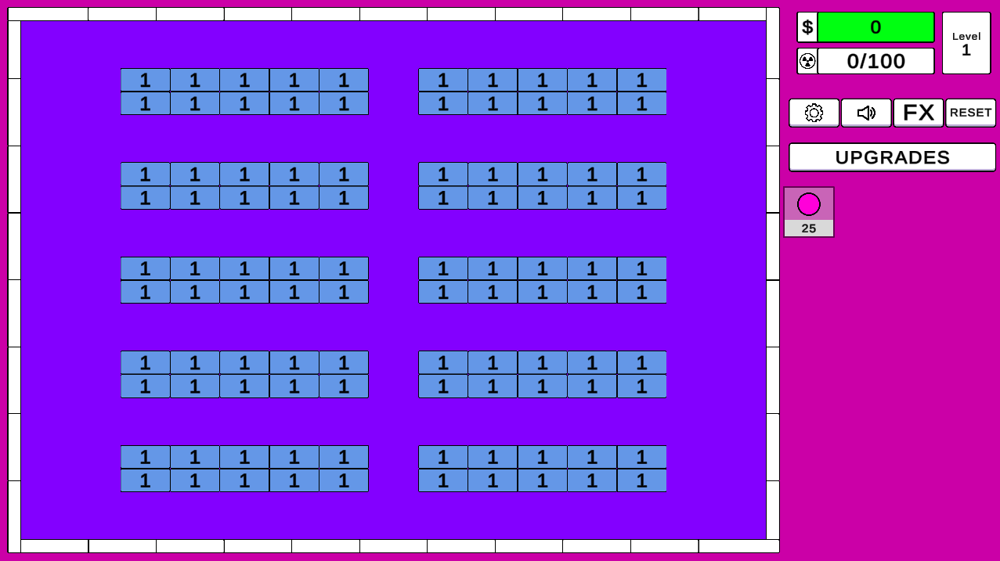
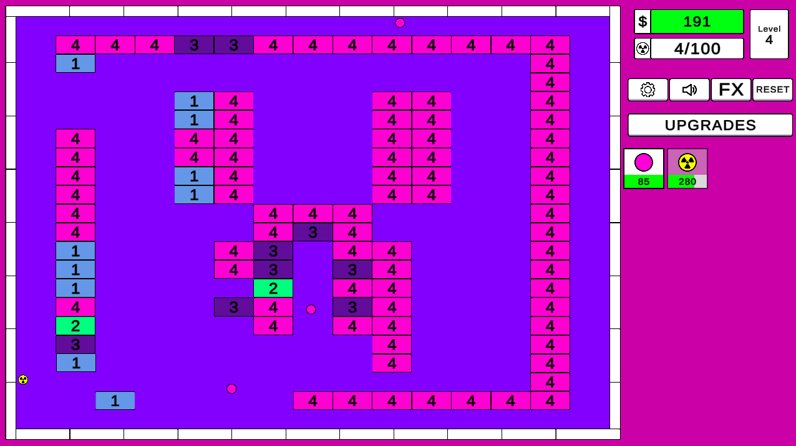
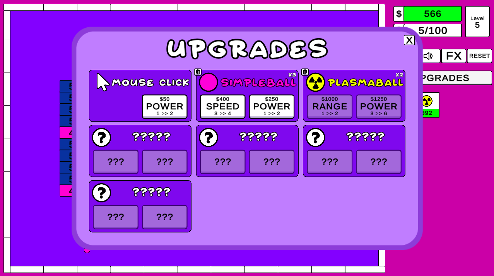
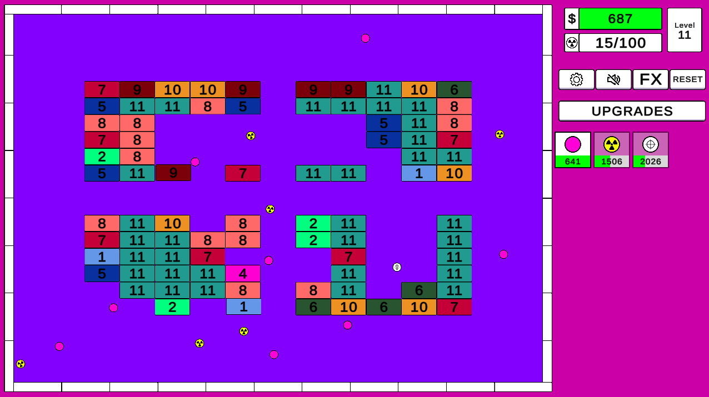

# IdleGame

## About

This is a Idle Game made with using the **[Arknoid](https://en.wikipedia.org/wiki/Arkanoid)** game concept.
You need to break the bricks, get money to buy new balls or upgrade the ones you alread have.
This game was made on **[Unity3D](https://unity.com/)** (Developed using **C#**).

## How To Play
#### It can be played on your browser by accessing the Github page
```sh
https://eskielsantana.github.io/idlegame/
```

#### Observations:

* This game was made on Unity3D and uses WebGL technology to run directly on the navigator.
* Use Google Chrome as a preferable navigator.
* Make sure the hardware acceleration is enabled on your navigator. Otherwise, the game will run slowly.

## Screenshots





## Author

* **Ezequiel Santana** - [LinkedIn](https://www.linkedin.com/in/ezequiel-santana/)